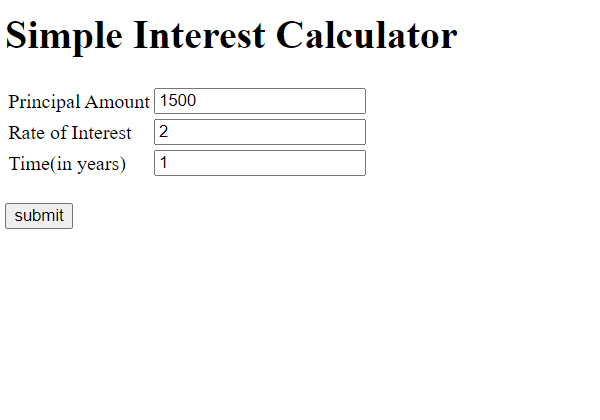
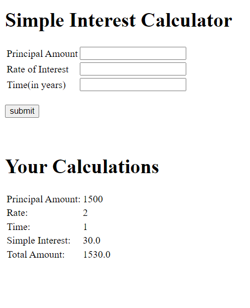

# Assignment 8
  
### Application Screenshots

### Tasks Done

- Create a web application with two java class
- Interest with a method SimInt() to calculate simple Interest
- Create a HelloServlet
- Create a JSP page
- JSP page calls sinIntMethod of Interest class and prints calculated Interest

Note:- Make sure the jsp is rendered from HelloServlet
