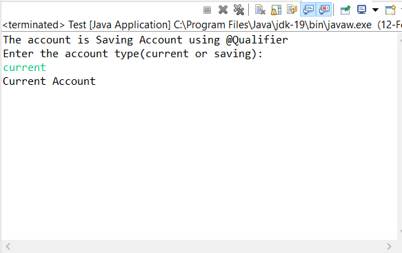

# Bank Application
  
### Application Screenshots

### Tasks Done

Create a new Spring Application. The details are as follows.

- Add a class named Customer in the src/main/java with all following attributes
     i. Name-String
     ii. Username-String
     iii. Password-String
     iv. Age-int
     v. SSN-String
     vi. Address-String(just city name)
     vii. Email-String
     viii. Phone-long
     ix. Balance-float

- Create an interface Account with showAccount() method.
- Inject Account interface in Customer class using @Autowired
- Create two classes Saving and Current implementing Account interface.
- Inject Saving/ Current account using @Qualifier while creating a customer.
